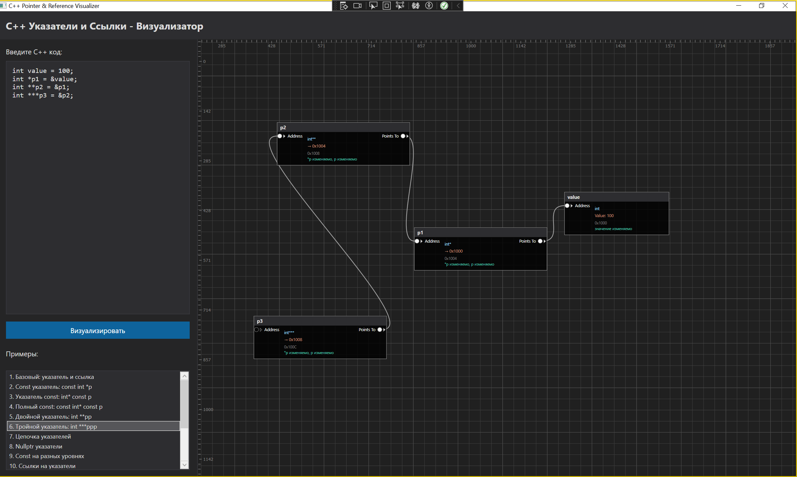
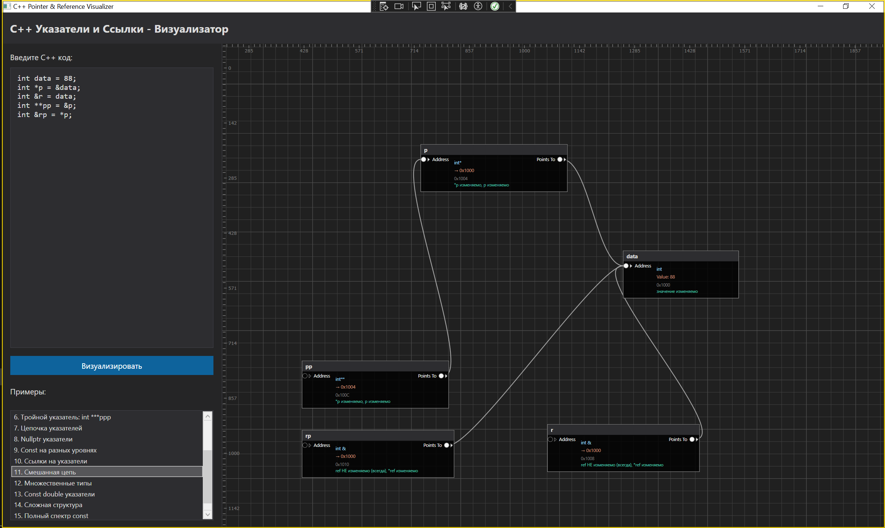
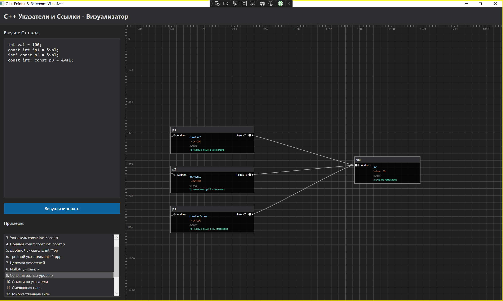
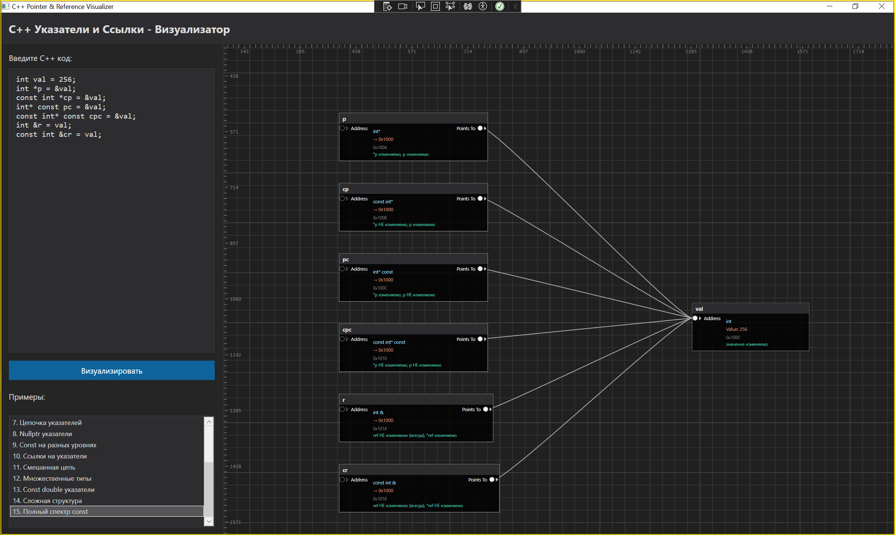
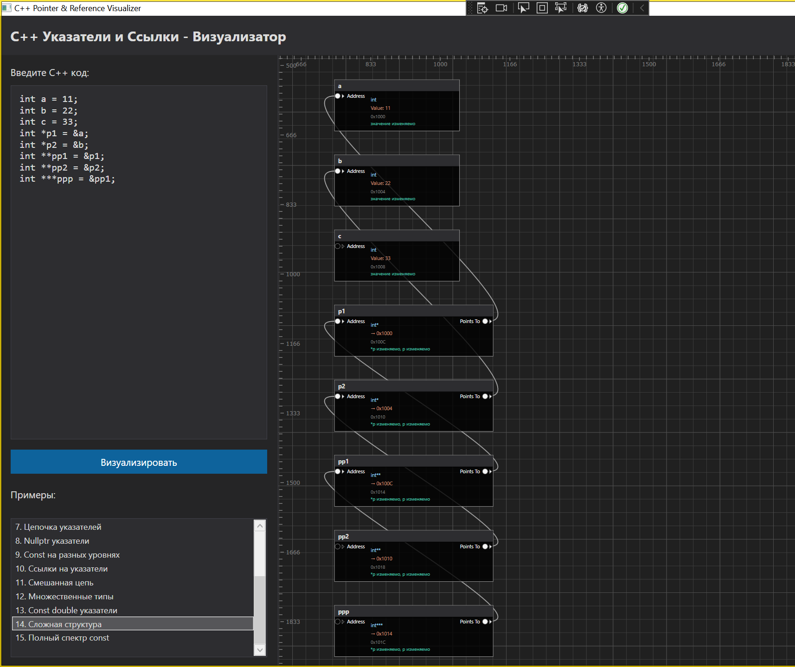

# C++ Указатели и Ссылки - Визуализатор

Интерактивный визуализатор для обучения концепциям указателей и ссылок в C++.



## Особенности

- 🎨 **Визуальное представление памяти**: Каждая переменная, указатель и ссылка отображаются как цветные блоки
- 🔗 **Стрелки связей**: Указатели и ссылки соединяются стрелками с целевыми объектами
- 📊 **Информация о модифицируемости**: Показывает, что можно и нельзя изменять (const анализ)
- 💡 **10 примеров**: От простых указателей до сложных конструкций с const
- 🖱️ **Интерактивность**: Вводите свой C++ код и смотрите визуализацию

## Цветовая схема

- 🔵 **Синий** - Обычные переменные (int, double, etc.)
- 🟣 **Фиолетовый** - Указатели (int*, int**, etc.)
- 🟢 **Зеленый** - Ссылки (int&, const int&, etc.)

## Примеры из статьи

### 1. Базовые концепции

```cpp
int a = 42;
int *p = &a;        // Указатель на переменную
int &ref = a;       // Ссылка на переменную
```

**Визуализация показывает:**
- Переменная `a` с значением 42
- Указатель `p` содержит адрес `a`
- Ссылка `ref` также указывает на `a`



### 2. Const указатель на данные

```cpp
int a = 42;
const int *p = &a;
```

**Модифицируемость:**
- ❌ `*p` НЕ изменяемо (const int)
- ✅ `p` изменяемо (можно перенаправить на другую переменную)



### 3. Указатель const

```cpp
int a = 42;
int b = 100;
int* const p = &a;
```

**Модифицируемость:**
- ✅ `*p` изменяемо
- ❌ `p` НЕ изменяемо (константный указатель)

### 4. Указатель на указатель

```cpp
int a = 42;
int *p = &a;
int **pp = &p;
```

**Визуализация показывает:**
- Цепочку: `pp` → `p` → `a`
- Две стрелки связывают три объекта

### 5. Const int**

```cpp
int a = 42;
const int *p = &a;
const int **pp = &p;
```

**Модифицируемость:**
- ❌ `**pp` НЕ изменяемо
- ✅ `*pp` изменяемо (указатель p)
- ✅ `pp` изменяемо

### 6. Ссылка на указатель

```cpp
int a = 42;
int *p = &a;
int* const &ref = p;
```

**Эквивалент:** `int* const *pointer = &p`

**Модифицируемость:**
- ❌ `ref` НЕ изменяемо (ссылки всегда неизменяемы)
- ✅ `*ref` изменяемо (можно менять *p)

### 7. Const ссылка на указатель

```cpp
int a = 42;
const int *p = &a;
const int* &ref = p;
```

**Модифицируемость:**
- ❌ `*ref` НЕ изменяемо (const int*)
- ✅ `ref` может указывать на другой адрес

### 8. Const ссылка на const указатель

```cpp
int a = 42;
const int* p = &a;
const int* const &ref = p;
```

**Полная защита:**
- ❌ `*ref` НЕ изменяемо
- ❌ `ref` НЕ изменяемо



## Как использовать

1. **Запустите приложение:**
   ```bash
   dotnet run --project CppPointerVisualizer
   ```

2. **Выберите пример** из списка слева или введите свой код

3. **Нажмите "Визуализировать"**

4. **Изучайте визуализацию:**
   - Каждый блок показывает имя, тип, значение/адрес
   - Стрелки показывают связи между объектами
   - Справа от блоков - информация о модифицируемости



## Правила const в C++

### Ключевое правило
**Const модифицирует элемент справа от него**

```cpp
const int *p       // const модифицирует int → *p неизменяемо
int const *p       // то же самое
int* const p       // const модифицирует * → p неизменяемо
const int* const p // оба неизменяемы
```

### Чтение типов справа налево

```cpp
const int* const &ref
```

Читаем: `&ref` - ссылка на → `const` - константный → `int*` - указатель на → `const int` - константный int

## Требования

- .NET 8.0 или выше
- Windows (WPF)

## Структура проекта

```
CppPointerVisualizer/
├── Models/
│   ├── MemoryObject.cs      # Модель объекта в памяти
│   └── MemoryState.cs       # Состояние всей памяти
├── Parser/
│   └── CppPointerParser.cs  # Парсер C++ кода
├── Visualization/
│   └── MemoryVisualizer.cs  # Визуализация на Canvas
├── MainWindow.xaml          # UI интерфейс
└── MainWindow.xaml.cs       # Логика приложения
```

## Ограничения

Текущая версия поддерживает:
- Простые переменные (int, double, etc.)
- Указатели любого уровня вложенности
- Ссылки на переменные и указатели
- Const модификаторы в различных позициях

Не поддерживается:
- Сложные выражения инициализации
- Структуры и классы
- Массивы
- Арифметика указателей
- Динамическое выделение памяти (new/delete)

## Улучшения в будущем

- [ ] Поддержка ANTLR для полного парсинга C++
- [ ] Анимация изменений памяти
- [ ] Пошаговое выполнение кода
- [ ] Поддержка структур и классов
- [ ] Экспорт визуализации в PNG/SVG

## Автор

Создано для помощи новичкам в понимании сложных концепций указателей и ссылок C++.

## Лицензия

MIT
